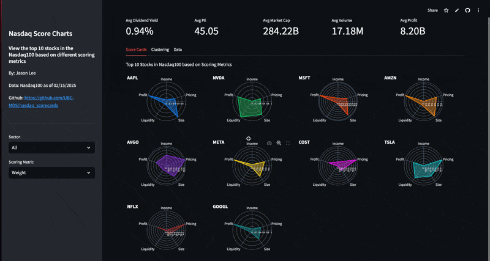

# 📈 Nasdaq Scorecards  
Author/Developer: Jason Lee

Interactive Streamlit app that ranks and visualizes the top 10 Nasdaq 100 stocks based on fundamental metrics like income, pricing, size, liquidity, and profit, helping investors make data-driven decisions.

## Motivation  

In today's digital age, mobile trading apps have made stock trading more accessible than ever. However, this ease of access has also gamified the experience, leading many investors to focus more on short-term price movements rather than the underlying fundamentals of the companies they invest in. This dashboard was created to encourage a more long-term, fundamentals-driven approach to investing. 

The dashboard provides a structured way to evaluate companies beyond just price action.  

## App Description

### Score Cards
To quantify key aspects of a stock's fundamentals, I developed a **scoring system** based on five core financial metrics. By visualizing these metrics using **radar charts**, the dashboard allows investors to quickly compare stocks and make more informed, data-driven decisions.   

1. **Income** – Derived from the stock's **dividend yield**, representing income-generating potential.  
2. **Price** – Based on the **P/E ratio**, reflecting how expensive the stock is relative to earnings.  
3. **Size** – Measured by **market capitalization**, indicating the company's overall valuation.  
4. **Liquidity** – Assessed using **trading volume**, representing how easily the stock can be bought or sold.  
5. **Profit** – Evaluated based on the company's **trailing 12-month profit**, showing overall profitability.  

### Clustering

The **Clustering** tab helps identify patterns among Nasdaq 100 stocks by grouping companies with **similar financial characteristics**. This is done using an **unsupervised machine learning technique** called **DBSCAN (Density-Based Spatial Clustering of Applications with Noise)**, which automatically detects groups of stocks based on the 5 scoring metrics mentioned above. The groupings of the different stocks are visualised using a **2D scatter plot** can be used for intuitive exploration. To achieve this 2D projection of the 5 scoring metrics, a dimensionality reduction technique called PCA was used.

### Data
Get a glimpse of the raw data for further exploration

## Features  
- **Filter stocks by sector** to focus on industries of interest.  
- **Choose different scoring metrics** to analyze stocks from multiple perspectives.  
- **Interactive charts** to compare top NASDAQ stocks side by side.  
- **Summary statistics** for a quick snapshot of market trends.  

This tool aims to shift the focus away from speculative trading and back toward **fundamental investing**, helping investors build a portfolio with long-term sustainability in mind. 



## Installation  

To set up and run the dashboard locally, follow these steps:  

### 1. Clone the repository  
```bash
git clone https://github.com/UBC-MDS/nasdaq_scorecards.git
cd nasdaq_scorecards
```
### 2. Create and activate a conda environment 
```bash
conda create --name nasdaq_scorecard python=3.12 -y
conda activate nasdaq_scorecard
```

### 3. Install [dependencies](https://github.com/UBC-MDS/nasdaq_scorecards/blob/main/requirements.txt)
```bash
pip install -r requirements.txt
```

### 4. Run the Streamlit app
```bash
streamlit run app.py
```
 

